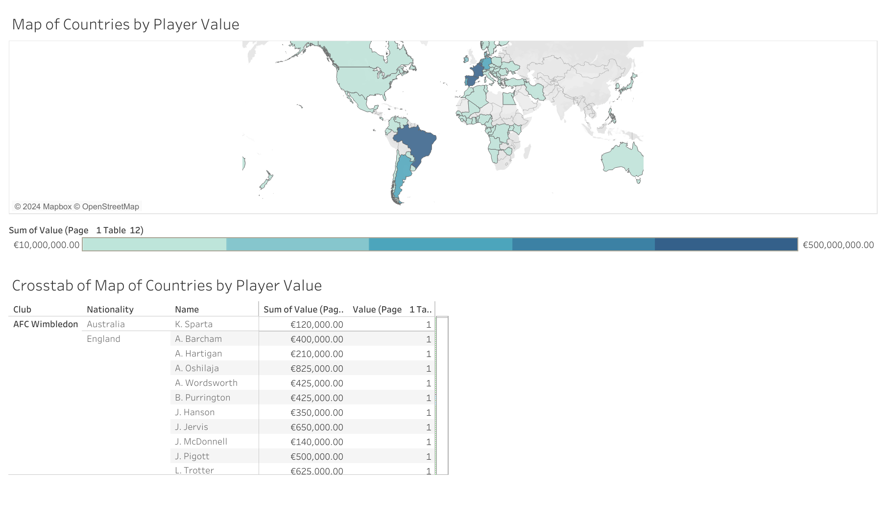

# English-Premier-League-Dashboard

# Tableau Dashboard: Player Value by Country

## Overview
This repository contains a Tableau dashboard that visualizes the total player value distributed across various countries. It includes a choropleth map highlighting countries with the highest cumulative player values and a crosstab for detailed insights.

### Features:
- **Map Visualization**: Countries are shaded according to the sum of player values, with a color gradient from €10 million to €500 million.
- **Crosstab**: A table below the map shows detailed information about each player, including their club, nationality, name, and value.

## How to View:
To explore the dashboard, download the `.twbx` file and open it using [Tableau Desktop](https://www.tableau.com/products/desktop) or [Tableau Public](https://public.tableau.com/s/). The dashboard will render the map and table for interactive exploration.

## Dashboard Preview:

## Data:
The data used in this dashboard is fictional and aims to represent player values across different countries for various clubs.
